 

  

### Building intelligent systems that move from idea to impact.

I’m an **AI Engineer** and final-year **Bachelor’s student in Artificial Intelligence** who enjoys building complete, practical software—not only training models. My work sits at the intersection of **Generative AI, LLM applications, RAG, AI agents, machine learning, and product engineering**.

I like taking an idea from concept to implementation: designing the intelligence layer, connecting APIs and databases, building the application, and turning it into something people can actually use.

 

 

## ⚡ What I build

`Generative AI` · `LLM Applications` · `RAG Systems` · `AI Agents` · `Machine Learning`  
`Computer Vision` · `Backend APIs` · `Automation` · `Data Science` · `AI Products`

 

## 🧰 Technology constellation

  

**AI / ML**  
TensorFlow · Scikit-learn · XGBoost · Hugging Face · YOLOv8 · NumPy · Pandas

**GenAI / Agentic Systems**  
LLM integration · Retrieval-Augmented Generation · Vector search · Prompt engineering · Agentic workflows

**Software / Data**  
Python · Java · C++ · R · React · Flask · SQL · MySQL · MongoDB · REST APIs · AWS

 

## ✦ Selected work

<table>
<tr>
<td width="33%" align="center">
<h3><a href="https://github.com/Kinjalpanjwani/AmazonProject">AmazonGPT</a></h3>
NLP-powered product discovery with transformer-based review generation and recommendations.
  <code>NLP · Transformers · Python</code>
</td>
<td width="33%" align="center">
<h3><a href="https://github.com/Kinjalpanjwani/Architecture-GPT-">Architecture GPT</a></h3>
Multimodal architectural ideation using LLM reasoning and AI image generation.
  <code>Gemini · DALL·E · React · Flask</code>
</td>
<td width="33%" align="center">
<h3><a href="https://github.com/Kinjalpanjwani/Deepfake-AI-detection-">Deepfake Detection</a></h3>
Explainable computer-vision platform for manipulated-image detection and analysis.
  <code>Computer Vision · XAI · Full Stack</code>
</td>
</tr>
</table>

 

## 🐍 Contribution trail

<picture>
  <source media="(prefers-color-scheme: dark)" srcset="https://raw.githubusercontent.com/Kinjalpanjwani/Kinjalpanjwani/output/github-contribution-grid-snake-dark.svg" />
  <source media="(prefers-color-scheme: light)" srcset="https://raw.githubusercontent.com/Kinjalpanjwani/Kinjalpanjwani/output/github-contribution-grid-snake.svg" />
  
</picture>

 

### A few things about me

💻 I genuinely enjoy software engineering—not only model training.  
🧩 I like understanding systems under the hood and simplifying complex problems.  
🤖 I’m especially interested in the shift from traditional ML toward autonomous, agentic AI.  
🛠️ My favorite way to learn a new framework, model, or API is to build something with it.

 

### Build. Experiment. Break things. Learn. Build better.

